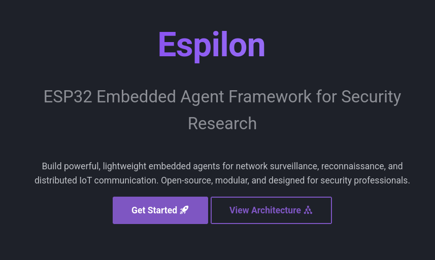
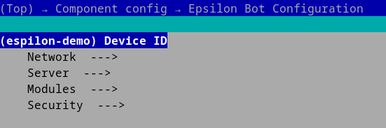

# Espilon


**Embedded ESP32 Agent Framework for Security Research and IoT**

[](LICENSE)
[](https://github.com/espressif/esp-idf)
[](https://www.espressif.com/en/products/socs/esp32)

> **IMPORTANT**: Espilon is intended for security research, authorized penetration testing, and education. Unauthorized use is illegal. Always obtain written permission before any deployment.

---

## Full Documentation

**[View the full documentation here](https://docs.espilon.net)**



---

The MkDocs documentation includes:

```md
- Step-by-step installation guide
- Translate EN/FR
- WiFi and GPRS configuration
- Module and command reference
- Multi-device flasher guide
- C2 protocol specification
- Examples and use cases
```

---

## Quick Start

### Prerequisites

- ESP-IDF v5.3.2
- Python 3.8+
- ESP32 (any compatible model)
- LilyGO T-Call for GPRS mode (optional)

### Quick Installation

```bash
# 1. Install ESP-IDF v5.3.2
mkdir -p ~/esp
cd ~/esp
git clone -b v5.3.2 --recursive https://github.com/espressif/esp-idf.git
cd esp-idf
./install.sh esp32
. ./export.sh

# 2. Clone Espilon
cd ~
git clone https://github.com/Espilon-Net/epsilon-source.git
cd Espilon-Net/espilon_bot

# 3. Configure with menuconfig or tools/flasher/devices.json
idf.py menuconfig

# 4. Build and flash
idf.py build
idf.py -p /dev/ttyUSB0 flash monitor
```

**Minimal configuration** (menuconfig):

```c
Espilon Bot Configuration
  |- Device ID: "your_unique_id"
  |- Network -> WiFi
  |   |- SSID: "YourWiFi"
  |   |- Password: "YourPassword"
  |- Server
      |- IP: "192.168.1.100"
      |- Port: 2626
```



---

## What is Espilon?

Espilon transforms affordable ESP32 microcontrollers (~$5) into powerful networked agents for:

- **Security research**: WiFi testing, network reconnaissance, IoT pentesting
- **Education**: Learning embedded systems, network protocols, FreeRTOS
- **IoT prototyping**: Distributed communication, monitoring, sensors

### Connectivity Modes

| Mode | Hardware | Range | Use Case |
|------|----------|-------|----------|
| **WiFi** | Standard ESP32 | 50-100m | Labs, buildings |
| **GPRS** | LilyGO T-Call | National (2G) | Mobile, remote |

---

## Architecture

```
+---------------------------------------------------------+
|                     ESP32 Agent                         |
|  +-----------+  +----------+  +---------------------+   |
|  |  WiFi/    |->| ChaCha20 |->|   C2 Protocol       |   |
|  |  GPRS     |<-|  Crypto  |<-|  (nanoPB/TCP)       |   |
|  +-----------+  +----------+  +---------------------+   |
|         |              |                 |              |
|  +-----------------------------------------------------+|
|  |           Module System (FreeRTOS)                  ||
|  |  [Network] [FakeAP] [Recon] [Custom...]             ||
|  +-----------------------------------------------------+|
+---------------------------------------------------------+
                        | Encrypted TCP
              +---------------------+
              |   C2 Server (C3PO)  |
              |  - Device Registry  |
              |  - Group Management |
              |  - CLI Interface    |
              +---------------------+
```

### Key Components

- **Core**: Network connection, ChaCha20 crypto, nanoPB protocol
- **Modules**: Extensible system (Network, FakeAP, Recon, etc.)
- **C2 (C3PO)**: Python asyncio server for multi-agent control
- **Flasher**: Automated multi-device flashing tool

---

## Available Modules

> **Important note**: Modules are **mutually exclusive**. You must choose **only one module** during configuration via menuconfig.

### System Module (Built-in, always active)

Basic system commands:

- `system_reboot`: Reboot the ESP32
- `system_mem`: Display memory usage (heap free, heap min, internal free)
- `system_uptime`: Uptime since boot

### Network Module

Module for network reconnaissance and testing:

- `ping <host> [args...]`: ICMP connectivity test
- `arp_scan`: Discover hosts on local network via ARP
- `proxy_start <ip> <port>`: Start a TCP proxy
- `proxy_stop`: Stop the running proxy
- `dos_tcp <ip> <port> <count>`: TCP load test (authorized use only)

### FakeAP Module

Module for creating simulated WiFi access points:

- `fakeap_start <ssid> [open|wpa2] [password]`: Start a fake access point
- `fakeap_stop`: Stop the fake AP
- `fakeap_status`: Display status (AP, portal, sniffer, clients)
- `fakeap_clients`: List connected clients
- `fakeap_portal_start`: Enable captive portal
- `fakeap_portal_stop`: Disable captive portal
- `fakeap_sniffer_on`: Enable network traffic capture
- `fakeap_sniffer_off`: Disable capture

### Recon Module

Reconnaissance and data collection module. Two modes available:

#### Camera Mode (ESP32-CAM)

- `cam_start <ip> <port>`: Start UDP video streaming (~7 FPS, QQVGA)
- `cam_stop`: Stop streaming

#### BLE Trilateration Mode

- `trilat start <mac> <url> <bearer>`: Start BLE trilateration with HTTP POST
- `trilat stop`: Stop trilateration

---

**Configuration**: `idf.py menuconfig` -> Espilon Bot Configuration -> Modules

Choose **only one module**:

- `CONFIG_MODULE_NETWORK`: Enable the Network Module
- `CONFIG_MODULE_FAKEAP`: Enable the FakeAP Module
- `CONFIG_MODULE_RECON`: Enable the Recon Module
  - Then choose: `Camera` or `BLE Trilateration`

---

## Tools

### Multi-Device Flasher

Automated flasher to configure multiple ESP32s:

```bash
cd tools/flasher
python3 flash.py --config devices.json
```

**devices.json**:

```json
{
  "project": "/path/to/espilon_bot",
  "devices": [
    {
      "device_id": "esp001",
      "port": "/dev/ttyUSB0",
      "network_mode": "wifi",
      "wifi_ssid": "MyNetwork",
      "wifi_pass": "MyPassword",
      "srv_ip": "192.168.1.100"
    }
  ]
}
```

See [tools/flasher/README.md](tools/flasher/README.md) for complete documentation.

### C2 Server (C3PO)

Command & Control server:

```bash
cd tools/c2
pip3 install -r requirements.txt
python3 c3po.py --port 2626
```

**Commands**:

- `list`: List connected agents
- `select <id>`: Select an agent
- `cmd <command>`: Execute a command
- `group`: Manage agent groups

---

## Security

### Encryption

- **ChaCha20** for C2 communications
- **Configurable keys** via menuconfig
- **Protocol Buffers (nanoPB)** for serialization

**CHANGE DEFAULT KEYS** for production use:

```bash
# Generate random keys
openssl rand -hex 32  # ChaCha20 key (32 bytes)
openssl rand -hex 12  # Nonce (12 bytes)
```

### Responsible Use

Espilon should only be used for:

- **Authorized** penetration testing
- **Ethical** security research
- Education and training
- Legitimate IoT prototyping

**Prohibited**: Unauthorized access, malicious attacks, privacy violations.

---

## Use Cases

### WiFi Pentesting

- Network security auditing
- WPA2/WPA3 robustness testing
- Network mapping

### IoT Security Research

- IoT device testing
- Protocol analysis
- Vulnerability detection

### Education

- Cybersecurity labs
- Embedded systems courses
- CTF competitions

---

## Roadmap

### V2.0 (In Progress)

- [ ] Mesh networking (BLE/WiFi)
- [ ] Improve documentation
- [ ] OTA updates
- [ ] Collaborative multilateration
- [ ] Memory optimization

### Future

- [ ] Custom Espilon PCB
- [ ] ESP32-S3/C3 support
- [ ] Module SDK for third-party extensions
- [ ] Web UI for C2

---

## License

Espilon is licensed under **MIT** with a security addendum.

See [LICENSE](LICENSE) for full details.

**In summary**:
- Free use for research, education, development
- Modification and distribution allowed
- **Obtain authorization** before any deployment
- Malicious use strictly prohibited

---

## Contributors

- **@Eun0us** - Core architecture, modules
- **@off-path** - C2 server, protocol
- **@itsoktocryyy** - Network features, work on Mod Wall Hack
- **@wepfen** - Documentation, tools

### Contributing

Contributions welcome! See [CONTRIBUTING.md](CONTRIBUTING.md).

**Join us**:

- Report bugs
- Propose features
- Submit PRs
- Improve documentation

---

## Useful Links

- **[Full documentation](https://docs.espilon.net)**
- **[ESP-IDF Documentation](https://docs.espressif.com/projects/esp-idf/)**
- **[LilyGO T-Call](https://github.com/Xinyuan-LilyGO/LilyGO-T-Call-SIM800)**
- **French README**: [README.md](README.md)

---

## Support

- **Issues**: [GitHub Issues](https://github.com/Espilon-Net/Espilon-Source/issues)
- **Discussions**: [GitHub Discussions](https://github.com/Espilon-Net/Espilon-Source/discussions)

---

**Originally presented at Le Hack (June 2025)**

**Made with love for security research and education**
